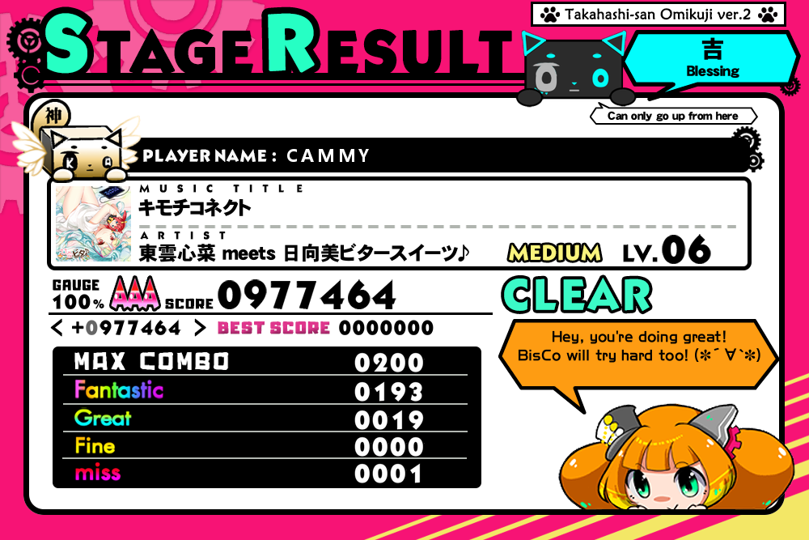
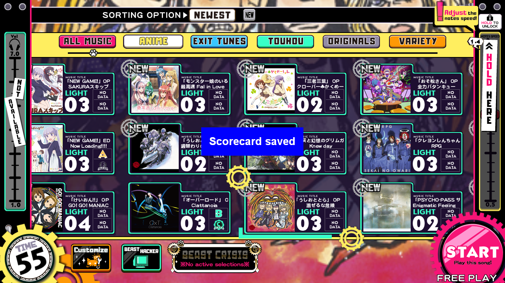

# Beatstream Scorecard ~~Hook~~
#### *It's not really a hook lol but it sounds more pro*

This program fetches score data from beatstream animtribe and sends it off to a scorecard server. The server 
should return an image file and the program will download and save it locally, and optionally upload it to discord.

### *But why? Beatstream already has a scorecard button*
I made this as a temporary solution until my server of choice supports the game's built-in scorecard function (which still just 
sends an xml request containing stage data) and the scorecard generator I wrote, and also as an excercise to see I could figure out where stage data was stored 
in the game and if python was able to retrieve it, since I don't know enough cpp to make an actual hook or any of this in 
another language. Needless to say the venture was fun and successful. 

# Installation
Current version: 1.1
[Grab the latest release here](https://github.com/camprevail/beatstream-scorecard-hook/releases/latest).  
Place the main exe, config.ini and dx9osd64.dll in your game's contents folder.  If you're using this on a cab, see the note at the bottom.  

### PC Players:
PC users will need to make the program run as admin in the file properties, cabs will run it as admin automatically.
Edit your gamestart.bat: add -k dx9osd64.dll to your launcher/spice arguments. (capital -K for launcher).  
There is a quirk caused by io emulation that will cause the program to stop receiving inputs once the game starts if the program starts before the game, 
so you will need to either start it as admin manually after the game gets to io check, or add a 60s delay to your batch file 
before starting it. That batch file example would look something like this:
```
cd /d %~dp0
start spice64 -k dx9osd64.dll
:: ~60s sleep
ping localhost -n 60 >nul
start bst-scorecard-hook.exe
```
Once that's configured, open config.ini and add the scorecard generator url if it was not included (I won't be posting my server url to github but 
you can ask me for it on discord). Be sure to go over the rest of the settings while you're in there.
Start the exe manually once to make sure it runs, optionally change the key mapping by pressing F12.  
If everything looks good, close it and launch your gamestart.bat.

### Cab Owners:
Edit your gamestart.bat: add `start bst-scorecard-hook.exe` on a line above launcher or spice64 so it runs in the 
background, and add -k dx9osd64.dll to your launcher/spice arguments. (capital -K for launcher).  
Open config.ini and add the scorecard generator url if it was not included (I won't be posting my server url to github but 
you can ask me for it on discord). Be sure to go over the rest of the settings while you're in there.  
**<u>Install Requirements for Cabs:</u>**   
-- Install the [x64 VC Redist](https://aka.ms/vs/17/release/vc_redist.x64.exe).  
-- Put `api-ms-win-core-path-l1-1-0.dll` in `c:\windows\system32`.  
-- Make sure the system clock is correct. If it's not, make sure you're connected to the internet, open up a command prompt and run  
`net start w32time`  
`w32tm /resync /force`  
-- Finally, run this to save all the above changes:  
`ewfmgr c: -commit & shutdown /r /t 0`


# Usage
The default key bindings are as follows:
```
ESC - Exit (not configurable)
F12 - Remap keys (not configurable)
current stage: Space
stage 1: 1
stage 2: 2
stage 3: 3
stage 4: 4
```
Press the current stage key when you complete a song to generate a scorecard. A message should pop up in the middle of the 
screen saying either Scorecard Saved or Scorecard Failed. If it failed or no message appeared, check the console to see what 
went wrong.  
The reason for individual stage keys is in case you missed/forgot it during the results screen. You can grab the score from
any stage you have already completed until the game logs you out. A warning will be printed to the console if you try to 
grab stage data before a song is complete.  

# Discord Integration
Creating a discord webhook in a server you manage is super easy.
1. Click the settings icon on any channel.
2. Go to the Integrations tab on the left side menu.
3. Go to Webhooks and click on New Webhook.
4. Expand your new webhook, optionally change the name, icon and channel.
5. Click on Copy Webhook URL, paste it into your config file, and enable the discord upload option.  

Now the OSD message will show "Scorecard uploaded" instead of "Scorecard saved".  
Note that there is a 5s cooldown between scorecard requests, and sometimes discord takes a minute to respond. So if it doesn't 
go through immediately, be patient and try again in a minute.





## External Links
dx9osd - https://github.com/setsumi/dx9osd  
api-ms-win-core-path dll - https://github.com/nalexandru/api-ms-win-core-path-HACK  
-- This is an implementation of api-ms-win-core-path-l1-1-0.dll based on Wine code. It is made to run Blender 2.93 
(specifically, Python 3.9) on Windows 7.  
bemani-scorecards - https://github.com/camprevail/bemani-scorecards
